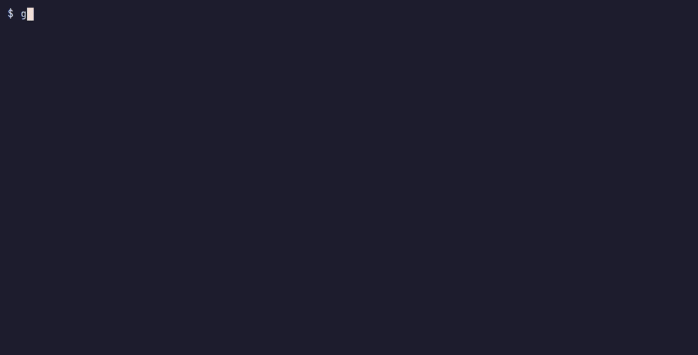

# ghwatch

Watch the CI of your GitHub pull requests from the terminal: one tab per PR,
every check with its state, and a desktop notification when a job fails.
Works with GitHub Actions and with external CI such as Prow / OpenShift CI.



## Quick start

```sh
go install github.com/clobrano/ghwatch/cmd/ghwatch@latest
ghwatch
```

Press `a`, paste a pull request URL, and it shows up in a new tab. ghwatch
uses your `gh` login (or `$GITHUB_TOKEN`), so there is nothing else to set up.

The keys you need day to day:

| Key | Action |
| --- | --- |
| `h` / `l` | previous / next PR |
| `j` / `k` | next / previous job |
| `enter` | open the selected job in the browser |
| `o` | open the PR in the browser |
| `a` / `d` | add / remove a PR |
| `?` | all the other keys |
| `q` | quit |

The footer always shows the main keys. [docs/tui.md](docs/tui.md) describes
the screen in detail.

## Notifications

Notifications are off until you ask for them:

- `n` on a PR: notify about its checks (failures, all passed, new push,
  merged).
- `b` on a job: notify about that job only.
- `N`: choose which events notify, or mute everything.

They need `notify-send` (libnotify). Clicking one opens the job or PR page.

## More

### tmux status line

```tmux
set -g status-right '#(ghwatch status) %H:%M'
set -g status-interval 10
```

This shows e.g. `PR ●3 ✓5 ✗1`. A trailing `!` means the data is stale.
`ghwatch status` reads a local file, so it costs nothing to refresh often.

ghwatch uses 24-bit colors. Inside tmux, enable true color, or the colors
are approximated:

```tmux
set -as terminal-features ',xterm-256color:RGB'
```

### Notifications without a TUI open

ghwatch runs a small background process (the daemon) that polls GitHub for
every open TUI. The TUI starts it, and it stops 10 seconds after the last
TUI closes. To keep notifications and the tmux line live with no TUI open,
run it yourself, for example in a tmux window:

```sh
ghwatch -serve
```

### Command line

```sh
ghwatch add <PR URL or owner/repo#N>   # watch a PR
ghwatch rm <PR>                        # stop watching it
ghwatch ls                             # list watched PRs
ghwatch checks <PR>                    # print a PR's checks, fetched now
ghwatch status [-json]                 # one-line summary, or the full state
ghwatch icons                          # preview the icon sets
```

### Configuration

Optional, in `~/.config/ghwatch/config.toml`:

```toml
interval = "60s"            # how often to poll GitHub (minimum 10s)
browser = "firefox"         # default: $BROWSER, then xdg-open
icons = "fancy"             # or "safe" if some icons show as boxes
status_template = 'PR {{if .Failed}}{{icon "failed"}}{{.Failed}}{{end}}'

[notify]
backend = "desktop"         # desktop | exec | none
# command = "curl -s -d @- ntfy.sh/my-topic"   # for backend = "exec"
```

- **Icons:** `icons = "safe"` uses characters every common monospace font
  has. Run `ghwatch icons` to compare the sets in your terminal.
- **Status template:** a Go `text/template` over `.Running`, `.Pending`,
  `.Passed`, `.Failed`, `.Queued`, `.Merged`, `.Closed`, `.Total` and
  `.Stale`. `{{icon "<state>"}}` prints a state's icon.
- **Exec notifier:** the `exec` backend pipes each notification as JSON
  to `command`, to send it anywhere, e.g. ntfy.sh or a chat webhook.
- **The watched PRs** are in `~/.config/ghwatch/watch`, one per line. You
  can edit the file by hand.

### Requirements

- A GitHub token: `gh auth login`, or `$GITHUB_TOKEN`.
- Linux; it also builds on macOS and the BSDs, where notifications need the
  `exec` backend.
- Optional: `notify-send` for notifications, `xdg-open` (or `$BROWSER`) for
  links, and a [Nerd Font](https://www.nerdfonts.com/) for the alert bell.

## Development

[docs/development.md](docs/development.md) covers how ghwatch works, the code
layout, extension points and re-recording the demo.
[docs/decisions.md](docs/decisions.md) explains the design choices, and
[docs/snapshot.md](docs/snapshot.md) the state format other tools can read.
